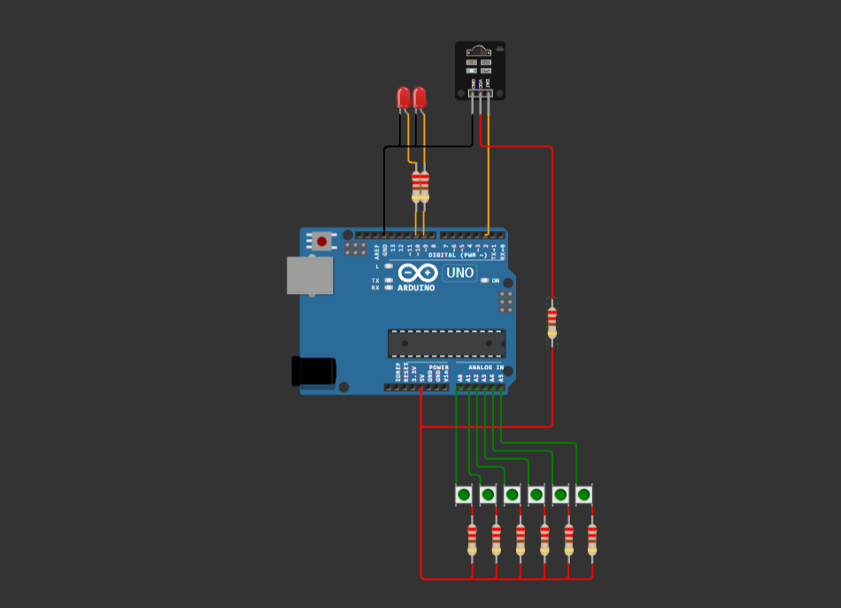

# Simple-Universal-Remote

A programmable, modular infrared remote built for the **[ATmega328P](https://ww1.microchip.com/downloads/en/DeviceDoc/Atmel-7810-Automotive-Microcontrollers-ATmega328P_Datasheet.pdf)** using the **[Arduino Uno R3](https://docs.arduino.cc/hardware/uno-rev3/)**. This project allows for the "learning" of infrared commands from existing remotes and replaying them, effectively acting as a universal remote duplicator using the NEC protocol.

## Introduction
This remote is an embedded system designed to capture, decode, store, and transmit 32-bit NEC infrared messages. Unlike a standard fixed-function remote, this device features a **Learning Mode** where it listens for an external IR signal, validates its integrity, and maps it to one of the physical buttons on the device.

The project is developed using **[Platform IO](https://platformio.org)**, leveraging a modular C architecture to handle low-level hardware interrupts, timer-based pulse width modulation (PWM) for the 38kHz carrier wave, and precise timing for signal decoding.

## Motivation
This project was heavily inspired by the educational content from **[Artful Bytes](https://www.youtube.com/@artfulbytes)**, which bridges the gap between abstract code and physical hardware. Here are the videos that inspired me:

* **[How Your Code Really Controls Hardware](https://www.youtube.com/watch?v=sp3mMwo3PO0)**
* **[NEC Protocol Driver (Infrared remote)](https://www.youtube.com/watch?v=K7eHkij-wNY)**

## Functionalities

### 1. Command Learning (Receiver Mode)
* **Signal Capture:** Uses an IR receiver connected to an external interrupt pin (INT0) to measure high/low pulse intervals with 10µs precision.
* **Protocol Validation:** Implements logic to ensure captured data is a valid NEC protocol by verifying that the address and command bytes are the exact logical bitwise inverses of their respective inverted counterparts.
* **Dynamic Mapping:** Users can enter a "Learning Mode" via a dedicated button (PINC5) to map a new IR signature to a target button.
* **Volatile Storage:** Please note that the learning functionality is **volatile**. Stored commands are kept in RAM and will be cleared if the device is reset or loses power.

### 2. Command Transmission (Sender Mode)
* **38kHz Carrier Generation:** Utilizes Timer1 in CTC mode to generate the precise 38kHz carrier frequency required for IR communication.
* **Protocol Replay:** Reconstructs the NEC frame, including the 9ms leading pulse, 4.5ms space, and the bit-modulated data, to control TVs, stereos, or other IR-enabled devices.

### 3. Project organization

```
Project
|
├───include - Header files folder
|   |
|   ├───buttons.h
|   ├───interrupts.h
|   ├───model.h
|   └───nec.h
|
├───src - Code folder
|   |
|   ├───buttons.c
|   ├───interrupts.c
|   ├───main.c
|   ├───model.c
|   └───nec.c
|
└───test - Contains Unit and Hardware tests
```

### 4. Physical circuit diagram



**Note** The LED connected to pin D10 is the **IR LED** while the other is a **normal LED**.

### 5. Last Notes

Despite working fairly well, the program may get stuck while on the receiving functionality. Despite my best efforts, I couldn't find a way to fix this bug. Therefore, to make the program and circuit work again, the user needs to reset the Arduino using the **Reset button**.
